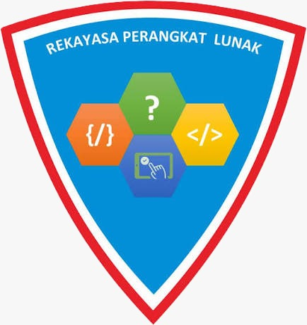
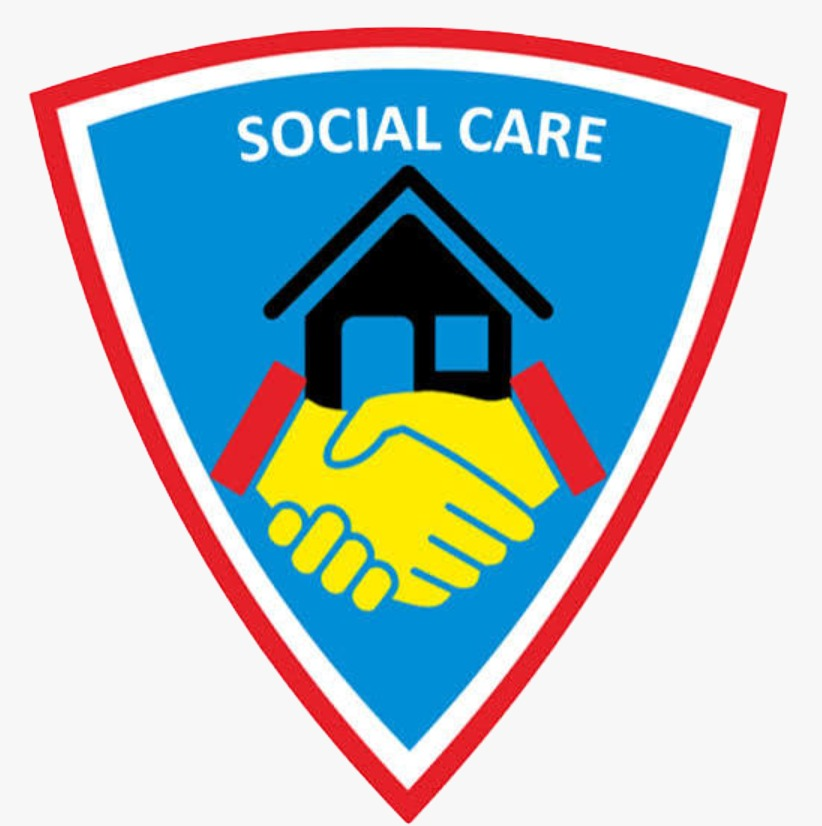
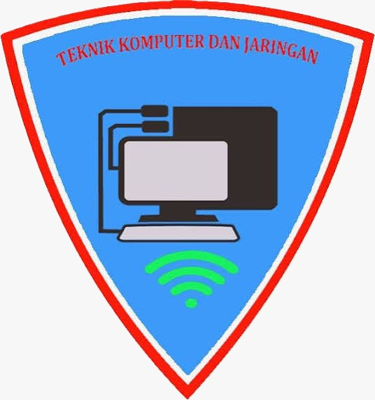
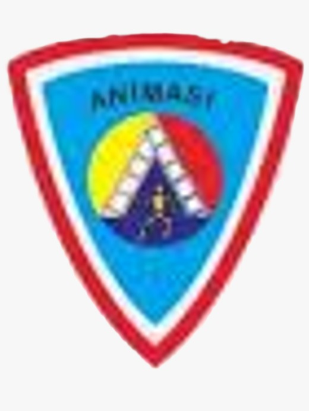
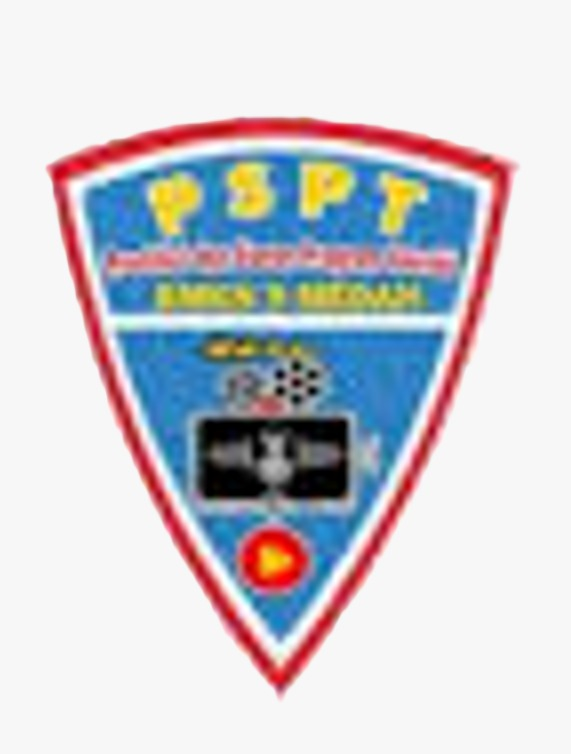

<!DOCTYPE html>
<html lang="id">
<head>
    <meta charset="UTF-8">
    <meta name="viewport" content="width=device-width, initial-scale=1.0">

    <title>Profil Murid RPL</title>

    <!-- Bootstrap 5 -->
    <link href="" rel="stylesheet">

    <!-- Bootstrap Icons -->
    <link rel="stylesheet" href="https://cdn.jsdelivr.net/npm/bootstrap-icons@1.11.3/font/bootstrap-icons.min.css">

    
</head>

<body data-bs-spy="scroll" data-bs-target="#navbar">

<!-- ================= NAVBAR ================= -->
<nav id="navbar" class="navbar navbar-expand-lg navbar-dark fixed-top">

    

        <a class="navbar-brand fw-bold" href="#beranda">
            <i class="bi bi-person-circle"></i>
            PROFIL MURID
        </a>

        <button class="navbar-toggler"
                type="button"
                data-bs-toggle="collapse"
                data-bs-target="#menu">

            

        </button>

        

            <ul class="navbar-nav ms-auto">

                <li class="nav-item">
                    <a class="nav-link" href="#beranda">
                        Beranda
                    </a>
                </li>

                <li class="nav-item">
                    <a class="nav-link" href="#tentang">
                        Tentang Saya
                    </a>
                </li>

                <li class="nav-item">
                    <a class="nav-link" href="#jurusan">
                        Jurusan
                    </a>
                </li>

                <li class="nav-item">
                    <a class="nav-link" href="#denah">
                        Denah
                    </a>
                </li>

                <li class="nav-item">
                    <a class="nav-link" href="#kontak">
                        Kontak
                    </a>
                </li>

            </ul>

        

    

</nav>

<!-- ================= BERANDA ================= -->
<section id="beranda" class="hero">

    

        

            

                

                    Selamat Datang
                

                <h1>
                    Halo, Saya
                    Syah Fitri Balqis
                </h1>

                <h4 class="mb-3">
                    Siswa Rekayasa Perangkat Lunak
                </h4>

                

                    Saya adalah siswa SMK yang sedang belajar
                    mengembangkan kemampuan di bidang teknologi,
                    pemrograman, dan pengembangan website.
                

                <a href="#tentang"
                   class="btn btn-primary">
                    Tentang Saya
                </a>

                <a href="#jurusan"
                   class="btn btn-outline-light">
                    Lihat Jurusan
                </a>

            

            

                

                    <i class="bi bi-person-fill"></i>

                

            

        

    

</section>

<!-- ================= TENTANG ================= -->
<section id="tentang" class="section">

    

        

            <h2>Tentang Saya</h2>

            

                Informasi singkat mengenai diri saya
            

        

        

            <!-- DATA DIRI -->
            

                

                    

                        <h4>
                            <i class="bi bi-person-vcard"></i>
                            Data Diri
                        </h4>

                        

                        

                            <strong>Nama:</strong>
                            Syah Fitri Balqis 
                        

                        

                            <strong>Kelas:</strong>
                            XI RPL
                        

                        

                            <strong>NIS:</strong>
                            14523
                        

                        

                            <strong>Jurusan:</strong>
                            Rekayasa Perangkat Lunak
                        

                        

                            <strong>Alamat:</strong>
                            Jl. mencirim prmh. persada suka maju No. 3
                        

                    

                

            

            <!-- KEAHLIAN -->
            

                

                    

                        <h4>
                            <i class="bi bi-code-slash"></i>
                            Keahlian
                        </h4>

                        

                        
HTML / CSS

                        

                            

                                85%
                            

                        

                        
JavaScript

                        

                            

                                70%
                            

                        

                        
PHP & MySQL

                        

                            

                                75%
                            

                        

                        
Git

                        

                            

                                65%
                            

                        

                    

                

            

        

    

</section>

<!-- ================= JURUSAN ================= -->
<section id="jurusan"
         class="section bg-light">

    

        

            <h2>6 Jurusan di Sekolah</h2>

            

                Kenali berbagai jurusan yang tersedia
            

        

        <!-- PILLS -->

        <ul class="nav nav-pills justify-content-center mb-4">

            <li class="nav-item">
                <button class="nav-link active"
                        data-bs-toggle="pill"
                        data-bs-target="#rpl">
                    RPL
                </button>
            </li>

            <li class="nav-item">
                <button class="nav-link"
                        data-bs-toggle="pill"
                        data-bs-target="#dkv">
                    DKV
                </button>
            </li>

            <li class="nav-item">
                <button class="nav-link"
                        data-bs-toggle="pill"
                        data-bs-target="#peksos">
                    PEKSOS
                </button>
            </li>

            <li class="nav-item">
                <button class="nav-link"
                        data-bs-toggle="pill"
                        data-bs-target="#tkj">
                    TKJ
                </button>
            </li>

            <li class="nav-item">
                <button class="nav-link"
                        data-bs-toggle="pill"
                        data-bs-target="#animasi">
                    ANIMASI
                </button>
            </li>

            <li class="nav-item">
                <button class="nav-link"
                        data-bs-toggle="pill"
                        data-bs-target="#pspt">
                    PSPT
                </button>
            </li>

        </ul>

        <!-- ISI JURUSAN -->

        

            <!-- RPL -->

            

                

                    

                        

                        <h3>
                            Rekayasa Perangkat Lunak
                        </h3>

                        

                            <strong>Visi:</strong>
                            Pengembang perangkat lunak
                            kompeten dan kreatif.
                        

                        

                            <strong>Misi:</strong>
                            Mengembangkan kemampuan pemrograman,
                            teknologi, kreativitas, dan pemecahan masalah.
                        

                    

                

            

            <!-- DKV -->

            

                

                    

                        

                        <h3>
                            Desain Komunikasi Visual
                        </h3>

                        

                            <strong>Visi:</strong>
                            Desainer visual kreatif
                            untuk industri kreatif.
                        

                        

                            <strong>Misi:</strong>
                            Mengembangkan kreativitas dan kemampuan
                            menghasilkan karya visual.
                        

                    

                

            

            <!-- PEKSOS -->

            

                

                    

                        

                        <h3>
                            Pekerjaan Sosial
                        </h3>

                        

                            <strong>Visi:</strong>
                            Tenaga sosial profesional
                            yang peduli dan berempati.
                        

                        

                            <strong>Misi:</strong>
                            Membentuk tenaga sosial yang mampu
                            membantu dan memberikan pelayanan sosial.
                        

                    

                

            

            <!-- TKJ -->

            

                

                    

                        

                        <h3>
                            Teknik Komputer dan Jaringan
                        </h3>

                        

                            <strong>Visi:</strong>
                            Teknisi dan administrator
                            jaringan yang handal.
                        

                        

                            <strong>Misi:</strong>
                            Mengembangkan kemampuan instalasi,
                            konfigurasi, dan pengelolaan jaringan.
                        

                    

                

            

            <!-- ANIMASI -->

            

                

                    

                        

                        <h3>
                            Animasi
                        </h3>

                        

                            <strong>Visi:</strong>
                            Animator kreatif dan produktif.
                        

                        

                            <strong>Misi:</strong>
                            Mengembangkan kreativitas dan kemampuan
                            menghasilkan karya animasi berkualitas.
                        

                    

                

            

            <!-- PSPT -->

            

                

                    

                        

                        <h3>
                            Produksi Siaran Program Televisi
                        </h3>

                        

                            <strong>Visi:</strong>
                            Insan pertelevisian profesional
                            dan beretika.
                        

                        

                            <strong>Misi:</strong>
                            Mengembangkan keterampilan produksi,
                            penyiaran, dan kreativitas di bidang televisi.
                        

                    

                

            

        

    

</section>

<section id="denah"
         class="section">

    

        

            <h2>Denah Sekolah</h2>

            

                Rute dari rumah menuju sekolah
            

        

        

            

                <h4>
                    <i class="bi bi-geo-alt-fill"></i>
                    Lokasi Sekolah
                </h4>

                

                    Tujuan:
                    <strong>
                        Jl. Patriot No. 20, Sunggal
                    </strong>
                

                

                    <iframe
                        src="https://www.google.com/maps?q=Jl.%20Patriot%20No.%2020,%20Sunggal&output=embed"
                       
